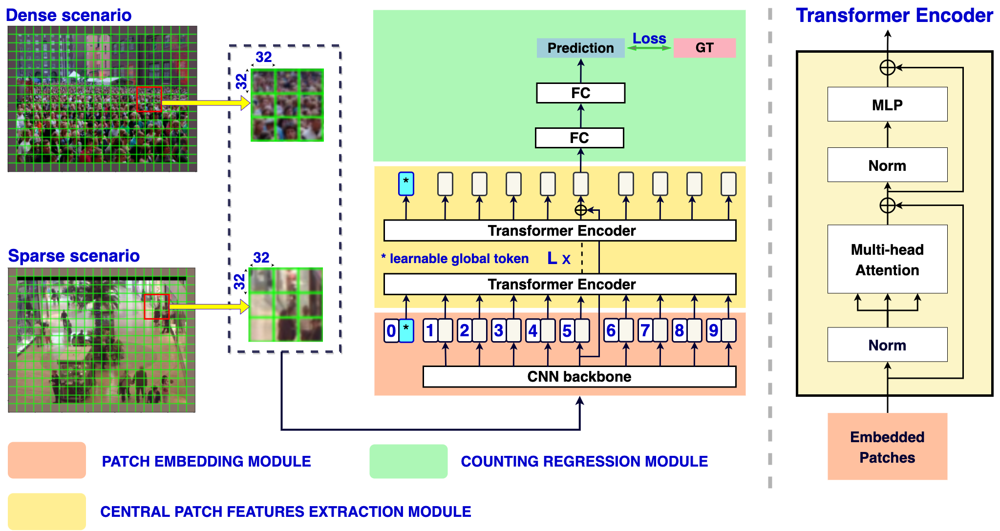

# LoViTCrowd
Official implementation of the accepted BMVC2022 paper "Improving Local Features with Relevant Spatial Information by Vision Transformer for Crowd Counting". 

This reporsitory contains the annotations for dataset and the code from the associated paper, for the task of crowd counting.

## Demo:
Our proposed LoViTCrowd can estimate precisely the number of existing people in lots of scenarios with the scene complexity and scale variation.

